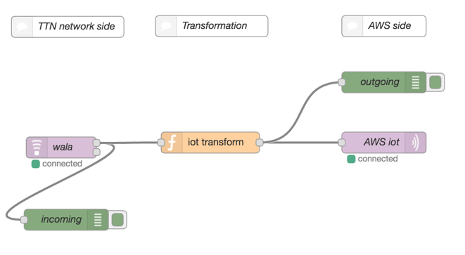
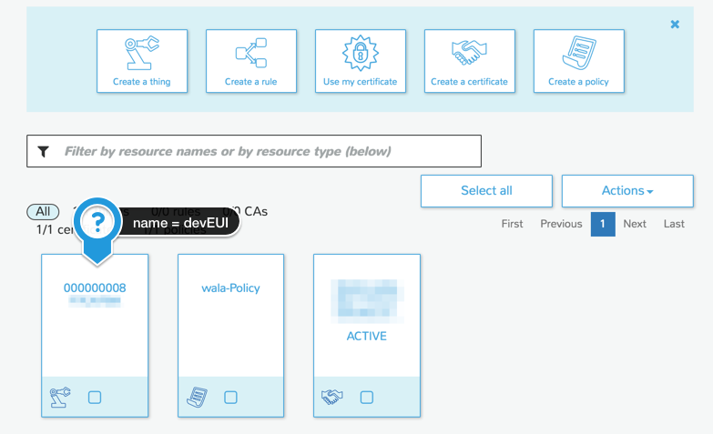

# NodeRED flow to update Thing shadows in AWS IoT from a TTN app.

It opens a connection to [a TTN app](https://staging.thethingsnetwork.org/) on the incoming side and a connection to the [AWS IoT](https://aws.amazon.com/iot/) MQTT broker on the outgoing side. Anything posted to the TTN app will be relayed to the according Thing shadow (based on the `devEUI`) on the AWS side.

## Flow


This example flow for NodeRED needs a [contrib node for TTN](https://www.npmjs.com/package/node-red-contrib-ttn) which you must install.

Alternatively you can use my [resin.io](http://www.resin.io)-based [NodeRED for TTN image](https://github.com/thesolarnomad/resin-node-red-ttn) to make it work out of the box on a RaspberryPi.

## Getting started
Create a new Thing (the name must be a valid `devEUI` with leading zeros):



with a certificate (download them!) and a policy:
```json
{
  "Version": "2012-10-17",
  "Statement": [
    {
      "Action": [
        "iot:*"
      ],
      "Resource": [
        "*"
      ],
      "Effect": "Allow"
    }
  ]
}
```

Then update the flow (`flow.json`):

* replace `<APPEUI>` and `<ACCESSKEY>` of the TTN node.
* update the broker host: `XXX.iot.XXX.amazonaws.com` to match what is shown as `REST API endpoint` when you look into the details of your created Thing in AWS IoT.
* put the certificates into the right spot and/or update the paths.

and finally import your adapted flow into NodeRED.
